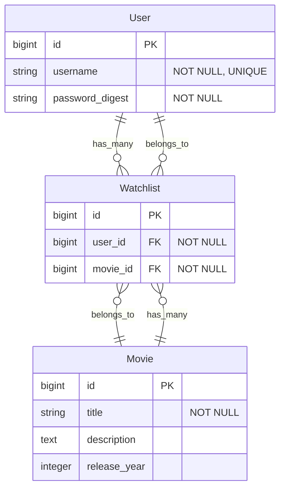
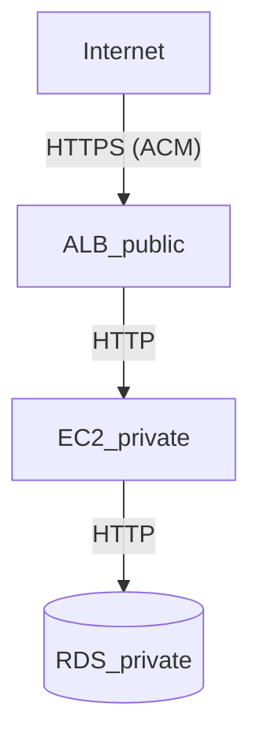

#### TODO:
- ✅ Model test
- ✅ OpenAPI doc (swagger)
- Implement APIs
  - User, ✅ Movie, Watchlist
- JWT auth
- ✅ Provision infra with Terraform
- Push Docker images to ECR (image registry)
- Use Auto Scaling Group (ASG)


# Rails Movie API

A RESTful movie API with OpenAPI and JWT auth.

Demo is available at: [https://rails-movie-api.bambi-dev.net/api-docs/index.html](https://rails-movie-api.bambi-dev.net/api-docs/index.html) (secured with Basic Auth)

## Tech Stack

- Ruby 3.3.8 / Rails 8.0.2
- PostgreSQL 16.9
- Docker 28.3.2 / Docker Compose v2.38.2
- Terraform 1.13.x (IaC for AWS resources)

---

## 🚀 Setup Instructions

### 🐳 Using Docker

```bash
git clone <repository-url>
cd <repository-name>
docker compose up
```

### 💻 Local Development

```bash
bundle install
bin/rails db:prepare # (db:create + db:migrate + db:seed)
bin/rails server
```

---

## ✅ Testing

```bash
# Using Docker
docker compose run --rm test

# Local Development
bundle exec rspec
```

---

## 📘 API Documentation

**Swagger UI**: http://localhost:3000/api-docs/index.html

### Quick Update
1. Edit `spec/requests/api/v1/docs/*_spec.rb`
2. Run `SWAGGER_DRY_RUN=false bin/rails rswag:specs:swaggerize`

### Test Files
- `docs/*_spec.rb` - Swagger generation
- `*_spec.rb` - Detailed API tests

---

## API Endpoints

### 🎬 Movies

| Method | Endpoint        | Description                        |
|--------|-----------------|------------------------------------|
| GET    | /movies         | Retrieve a list of movies          |
| POST   | /movies         | Create a new movie                 |
| GET    | /movies/{id}    | Retrieve details of a specific movie |
| PUT    | /movies/{id}    | Fully update movie information     |
| PATCH  | /movies/{id}    | Partially update movie information |
| DELETE | /movies/{id}    | Delete a movie                     |


### 📺 Watchlist

| Method | Endpoint                              | Description                              |
|--------|---------------------------------------|------------------------------------------|
| GET    | /users/me/watchlists                  | Retrieve the current user's watchlist    |
| POST   | /users/me/watchlists                  | Add a movie to the watchlist             |
| DELETE | /users/me/watchlists/{movie_id}       | Remove a movie from the watchlist        |


### 🔐 Authentication

| Method | Endpoint         | Description                 |
|--------|------------------|-----------------------------|
| POST   | /auth/login      | Issue JWT upon login        |
| POST   | /auth/refresh    | Refresh access token        |


---

## Database Schema

### ER Diagram



*Note: Standard Rails timestamps (created_at, updated_at) are omitted from the diagram for clarity*

### Constraints
- `(user_id, movie_id)` combination must be unique in Watchlists

---

## Architecture



---

This README would normally document whatever steps are necessary to get the
application up and running.

Things you may want to cover:

* Ruby version

* System dependencies

* Configuration

* Database creation

* Database initialization

* How to run the test suite

* Services (job queues, cache servers, search engines, etc.)

* Deployment instructions

* ...
